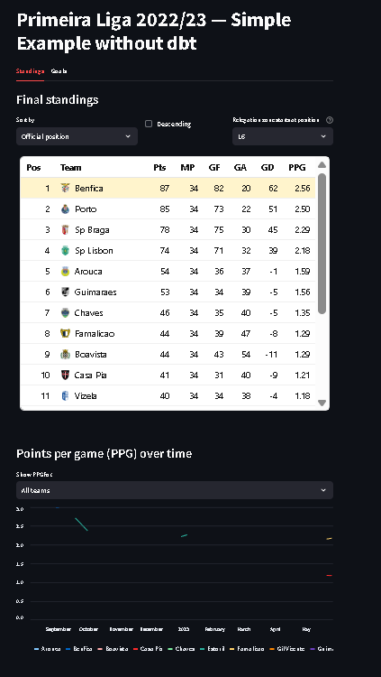
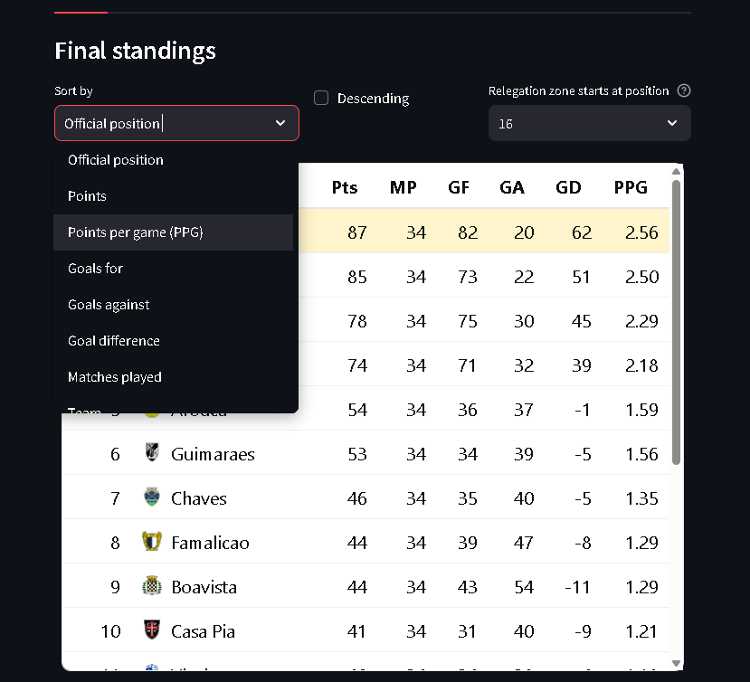
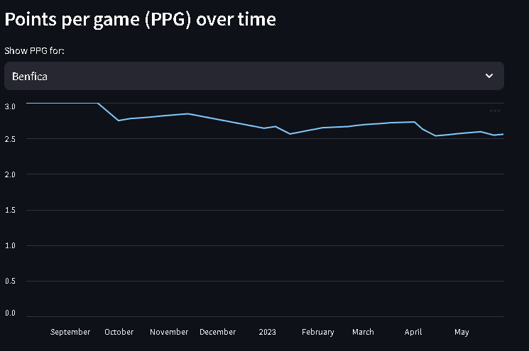
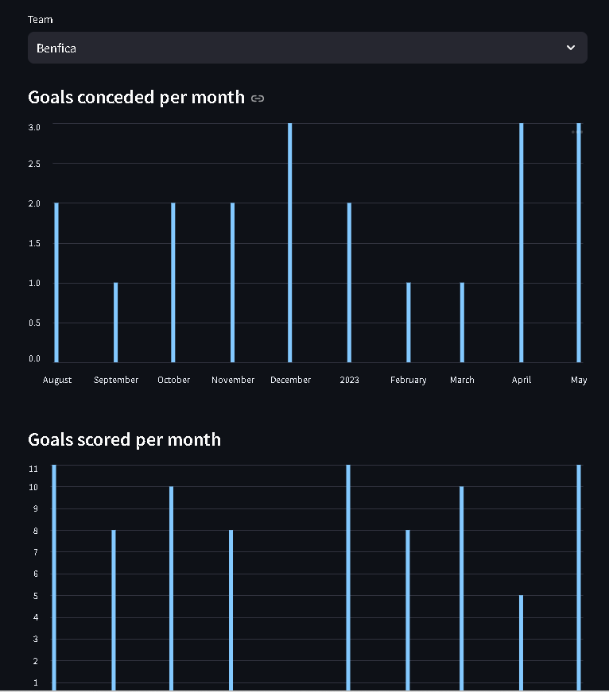

# Football & Weather Analytics on Snowflake

## 📌 Project Overview

This repository contains an **end-to-end data engineering project**
designed to showcase **hands-on Snowflake expertise** through a
realistic ELT pipeline and analytics use case.

The project ingests football match data, models it inside Snowflake
using a **RAW → STG → MART** architecture, and exposes analytics through
an interactive **Streamlit dashboard**.

This is intentionally built as a **portfolio-quality Snowflake
project**, emphasizing: - Clear data modeling and SQL proficiency -
Practical ELT design (not toy examples) - Analytics-ready outputs
consumed by real applications

------------------------------------------------------------------------

## 🧠 Business & Analytics Use Case

The dataset covers **Primeira Liga 2022/23** football matches.

From raw match-level data, the project produces: - Official league
standings - Points-per-game (PPG) metrics - Team performance trends over
time - Monthly goals scored and conceded

The architecture is **extensible by design**, with planned integration
of **weather data (NOAA)** to analyze environmental impact on match
performance.

------------------------------------------------------------------------

## 🏗️ Architecture Overview

    football-weather-analytics
    │
    ├── ingestion/                # Python ingestion layer
    │   ├── ingestAll.py          # Orchestrates all ingestions
    │   ├── csvFootball.py        # Football CSV ingestion
    │   └── snowflake_io.py       # Snowflake connectivity & RAW inserts
    │
    ├── sql/                      # Snowflake SQL transformations
    │   ├── 01_init.sql           # Database & schema initialization
    │   ├── 10_stgMatches.sql     # RAW → STG normalization
    │   └── 20_martKpis.sql       # STG → MART KPIs
    │
    ├── dashboard/                # Analytics & visualization
    │   ├── app.py                # Streamlit dashboard
    │   └── data/
    │       └── exportToCSV.py    # Optional MART exports
    │
    ├── images/                   # Dashboard screenshots
    │   ├── 1st.png
    │   ├── 2nd.png
    │   ├── 3rd.png
    │   └── 4th.png
    │
    ├── .env                      # Environment variables (not committed)
    ├── requirements.txt
    ├── Makefile
    └── README.md

------------------------------------------------------------------------

## 🔄 Data Flow & Design Decisions

### 1. Ingestion (Python → Snowflake RAW)

-   Public football CSV is downloaded via HTTP
-   Each record is stored **unchanged** in Snowflake using `VARIANT`
-   Metadata columns (`source`, `ingested_at`) enable lineage and
    reprocessing

**Why this matters:**\
This mirrors real-world ingestion patterns and avoids premature schema
coupling.

### 2. Transformation (Snowflake SQL)

-   RAW → STG: typing, cleaning, normalization
-   STG → MART: analytics-ready KPIs using window functions and
    aggregations

**Why this matters:**\
All business logic lives inside Snowflake, following modern ELT best
practices.

### 3. Consumption (Streamlit)

-   Dashboard queries Snowflake directly
-   Cached queries reduce cost and latency
-   MART tables can also be exported to CSV

------------------------------------------------------------------------

## 🗄️ Data Modeling Strategy

  Layer   Purpose               Key Characteristics
  ------- --------------------- -------------------------
  RAW     Immutable ingestion   VARIANT, schema-on-read
  STG     Clean & typed         Normalized columns
  MART    Analytics-ready       KPIs, aggregates

------------------------------------------------------------------------

## 📊 Dashboard Capabilities

The Streamlit application demonstrates how Snowflake-modeled data can be
consumed directly by analytics tools.

Key features: - Interactive league standings - Custom sorting & ranking
logic - Points-per-game evolution over time - Monthly goal analysis per
team - Parameterized season boundaries - Query-level caching

------------------------------------------------------------------------

## 📸 Dashboard Preview

The screenshots below are ordered to **tell a clear analytics story**,
starting from high-level outcomes and drilling down into trends.

### 1️⃣ League Standings (Final Outcome)

League table computed from Snowflake STG data, with champion and
relegation zones highlighted.



------------------------------------------------------------------------

### 2️⃣ Points Per Game Over Time (Performance Trends)

Cumulative PPG time series showing how team performance evolves
throughout the season.



------------------------------------------------------------------------

### 3️⃣ Monthly Goals Conceded (Defensive Analysis)

Month-by-month aggregation of goals conceded for a selected team.



------------------------------------------------------------------------

### 4️⃣ Monthly Goals Scored (Offensive Analysis)

Monthly breakdown of goals scored, enabling comparison with defensive
output.



------------------------------------------------------------------------

## 🧰 Tech Stack

-   **Snowflake** (cloud data warehouse)
-   **SQL** (transformations & analytics)
-   **Python** (ingestion & utilities)
-   pandas, requests
-   Streamlit
-   python-dotenv

------------------------------------------------------------------------

## ⚙️ Running the Project

``` bash
make setup      # Install dependencies
make ingest     # Run data ingestion
make dashboard  # Launch Streamlit app
```

------------------------------------------------------------------------

## 🚀 Roadmap & Extensions

Planned improvements: - NOAA weather ingestion - Match + weather
analytics - Incremental ingestion patterns - dbt-based transformations -
Snowflake tasks & streams - Cost and performance optimization

------------------------------------------------------------------------

## 👤 Author

**Luís Figueiredo**\
Data Engineer --- 5+ years of experience

This project is part of a personal portfolio to demonstrate
**production-oriented Snowflake data engineering**, strong SQL modeling,
and analytics-focused thinking.
